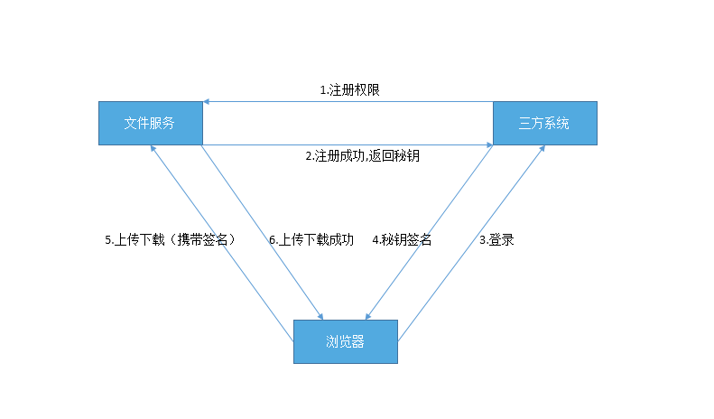

## 文件服务解决方案


## 1.概述  
  
#### 项目背景
   
   传统项目都提供上传下载功能，而上传下载功能又大多一致，意味着可以将上传下载服务与项目分离出来，单独提供服务，大大提高服务重用性，方便统一管理文件。而公司现存的文件服务，上传需要安装插件，且插件只在火狐浏览器下生效，而且该文件服务对大文件上传和断点续传并不支持，同时对上传下载的权限管理不完善，不利于三方系统使用。所以部门现在决定开发一套新的文件服务，新的文件服务将完善旧文件服务的不足。即：上传无需安装插件，支持绝大多数浏览器，支持大文件上传、断点续传、秒传，支持权限管理以及根据权限上传下载。
   
#### 建设目标
   
   完善旧文件服务的不足，做到上传无需安装插件，支持绝大多数浏览器，支持大文件上传、断点续传、秒传，支持权限管理以及根据权限上传下载。
   
-------
## 2.角色概述

#### 角色描述
   - **文件服务**  
   为三方系统和浏览器提供上传下载功能的服务，即本文档描述的需要开发的部分。
   - **三方系统**  
   任何使用本文件服务进行上传下载的第三方系统。
   - **浏览器**  
   用户用来访问系统的客户端。
   
#### 角色关系
     
   
   文件服务&三方系统：授权。  
   三方系统&浏览器：获权。  
   浏览器&文件服务：持权操作。  
   
-------   
### 文件服务接口设计    

### 1.服务接口
#### 大文件上传接口(>50M) POST  
   `upload.html`        
    
   URL示例  
                
   `file.go.gionee.com/upload.html?code=workFlow&signature=vjbyPxybdZaNmGa%2ByT272YEAiv4%3D&fileInfo=bdZaNmGa%2x3wst&2fcByT272YEAi&step=1`
     
    
   <table>
        <tr>
            <th>参数</th>
            <th>类型</th>
            <th>说明</th>
        </tr>
        <tr>
            <td>code</td>
            <td>String</td>
            <td>可选参数，注册权限时使用的系统编码，由三方系统提供</td>
        </tr>
        <tr>
            <td>signature</td>
            <td>String</td>
            <td>可选参数，用为注册得到的key加密的签名，由三方系统提供</td>
        </tr>
        <tr>
            <td>fileInfo</td>
            <td>String</td>
            <td>可选参数，上传文件的信息，signature中的参数经过base64编码后的结果，由三方系统提供 </td>
        </tr>
        <tr>
            <td>step</td>
            <td>int</td>
            <td>必填参数，将上传控件调用的4个接口合并为一个接口，step作为区分调用步骤，由上传控件选择，上传控件内部使用 </td>
        </tr>
        <tr>
            <td>call</td>
            <td>String</td>
            <td></td>
        </tr>
        <tr>
            <td>file</td>
            <td>String</td>
            <td>可选参数，可指定上传文件内容，只限第三步传入该参数</td>
        </tr>
        <tr>
            <td>savepath</td>
            <td>String</td>
            <td>可选参数，为上传文件路径，可选。如果不填，则上传到三方系统默认路径，只限第四步传入该参数</td>
        </tr>
        <tr>
            <td>tmp</td>
            <td>int</td>
            <td>可选参数，标识是否为临时状态，1为临时文件，0为普通文件，第四步传入</td>
        </tr>
    </table>

   `fileInfo`，`signature`计算规则如下，由于使用到key机加密，所以计算过程不应该暴露给用户，所以尽量不要再前端和客户端计算`signature`
   `call`值为如下所示的base64结果的UTF-8编码值:  
```
    {
            url:"hr.gionee.com/test.html",
            param:"fileNo={fileNo}&size={fileSize}&name={fileName}&var1=100"
    }
```

   url为上传完成的回调Url，即上传完成后，文件服务会向url发送一个携带param中参数的post请求，请求中会携带签名。
   signature=base64(hmac-sha1(key，param)，三方系统可据此签名判断是否是文件服务发来的请求。  
   param为回调请求的参数，值中${fileNo}，${fileName}和${fileSize}为可以传递到回调的系统变量值，fileNo为文件id，size为文件大小,name为文件名称。目前只支持这三个参数。
   var1为用户自定义参数，多个用&隔开。call响应内容必须是json格式，文件服务接受到响应后，会将三方服务回调的内容一起响应到客户端。

```
        signature = urlencode(base64(hmac-sha1(key，date+'\n'+fileMd5+'\n'+fileName+'\n'+filesize+'\n'+chunkMd5+'\n'+chunkSize)))
        fileInfo = urlencode(base64(date+'\n'+fileMd5+'\n'+fileName+'\n'+filesize+'\n'+chunkMd5+'\n'+chunkSize))  
```

   若fileInfo签名后与signature不一致，文件服务将拒绝请求。 
   其中`date`为当前时间格式GMT格式，必填，如：Tue 23 May 2017 00:53:45 GMT，如果date时间和文件服务器的时间差5分钟以上，将不提供服务。`date`用来防止不同文件相同md5盗用url进行上传的情况。`code`为系统编码，必填，`fileMd5`为文件md5值，必填，
   `filename`为上传文件名称，必填，`filesize`为上传文件名称，必填，如果签名中`filesize`，`fileMd5`，`filename`与上传文件信息不一致，文件服务将拒绝该请求。`chunkmd5`为上传文件块的md5值。
   此接口可用于验证权限及判断文件重复，判断文件块重复，通知文件块合并，验证权限及上传文件块，通过step区分，step不同，参数也不同。  
   step:  
   1.验证权限及判断文件，上传控件上传文件之前调用，验证`signature`是否合法，如果不合法，将停止上传，否则继续下面的步骤。 
   2.判断文件块重复，大文件每个文件块上传之前调用，验证文件块是否已存在，如果存在，则跳过。  
   3.验证权限及上传文件块，上传文件块时调用，验证`signature`是否合法，并将文件块写入文件服务器。  
   4.通知文件块合并，所有文件分块上传完成之时调用，通知文件服务合并该文件所有文件块。  
   其中1，3必需要传入`code`和`signature`。  
   signature计算中'\n'不能省略，参数必须顺序一致，policy必须和signature中的参数一致。  
   

#### 普通文件上传接口(<=50M) POST
   `common_upload.html`
   
    
   URL示例  
    `file.go.gionee.com/common_upload.html?code=workFlow&signature=vjbyPxybdZaNmGa%2ByT272YEAiv4%3D&fileInfo=bdZaNmGa%2x3wst&2fcByT272YEAi`
     
    
   <table>
        <tr>
            <th>参数</th>
            <th>类型</th>
            <th>说明</th>
        </tr>
        <tr>
            <td>code</td>
            <td>String</td>
            <td>可选参数，注册权限时使用的系统编码，由三方系统提供</td>
        </tr>
        <tr>
            <td>signature</td>
            <td>String</td>
            <td>可选参数，用为注册得到的key加密的签名，由三方系统提供</td>
        </tr>
        <tr>
            <td>fileInfo</td>
            <td>String</td>
            <td>可选参数，上传文件的信息，signature中的参数经过base64编码后的结果，由三方系统提供 </td>
        </tr>
        <tr>
            <td>call</td>
            <td>String</td>
            <td>可选参数，指定上传完成的回调URL</td>
        </tr>
        <tr>
            <td>f</td>
            <td>String</td>
            <td>可选参数，该参数是上传文件内容</td>
        </tr>
        <tr>
            <td>savepath</td>
            <td>String</td>
            <td>可选参数，为上传文件路径，可选。如果不填，则上传到三方系统默认路径。</td>
        </tr>
        <tr>
            <td>tmp</td>
            <td>int</td>
            <td>可选参数，标识是否为临时状态，1为临时文件，0为普通文件，默认为普通文件</td>
        </tr>
    </table>

   `fileInfo`，`signature`计算规则如下，由于使用到key机加密，所以计算过程不应该暴露给用户，所以尽量不要再前端和客户端计算`signature`。  
   `call`值为如下所示的base64结果的utf-8编码值:  
```
        {
            url:"hr.gionee.com/test.html",
            param:"fileNo={fileNo}&size={fileSize}&name={fileName}&var1=100"
        }  
```
   url为上传完成的回调Url，即上传完成后，文件服务会向url发送一个携带param中参数的post请求，请求中会携带签名。
   signature=base64(hmac-sha1(key，param)，三方系统可据此签名判断是否是文件服务发来的请求。  
   param为回调请求的参数，值中${fileNo}，${fileName}和${fileSize}为可以传递到回调的系统变量值，fileNo为文件id，size为文件大小,name为文件名称。目前只支持这三个参数。
   var1为用户自定义参数，多个用&隔开。call响应内容必须是json格式，文件服务接受到响应后，会将三方服务回调的内容一起响应到客户端。  
       
```
        signature = urlencode(base64(hmac-sha1(key，date+'\n'+fileMd5+'\n'+filename+'\n'+filesize)))
        fileInfo = urlencode(base64(date+'\n'+fileMd5+'\n'+filename+'\n'+filesize))  
```
    
   若fileInfo签名后与signature不一致，文件服务将拒绝请求。 
   其中`date`为当前时间格式GMT格式，必填，如：Tue 23 May 2017 00:53:45 GMT，如果date时间和文件服务器的时间差5分钟以上，将不提供服务。`date`用来防止不同文件相同md5盗用url进行上传的情况。`code`为系统编码，必填，`fileMd5`为文件md5值，必填，
   `filename`为上传文件名称，必填，`filesize`为上传文件名称，必填，如果签名中`filesize`，`fileMd5`，`filename`与上传文件信息不一致，文件服务将拒绝该请求。
   如果文件大于50M，服务将拒绝请求。
     
     
   <strong>通过`f`参数上传</strong>  
   分别计算`signature = urlencode(base64(hmac-sha1(key，date+'\n'+fileMd5+'\n'+filename+'\n'+filesize)))`，`fileInfo = urlencode(base64(date+'\n'+fileMd5+'\n'+filename+'\n'+filesize))`，
   `file = urlencode(base64(文件内容...))`。再将`signature`,`fileInfo`,`file`,`code`这三个参数传入即可。若文件内容是字符，请用UTF-8解码。再转bas64。
   URL示例	 
      `file.go.gionee.com/download.html?code=workFlow&signature=vjbyPxybdZaNmGa%2ByT272YEAiv4%3D&fileInfo=vjbyPsdf&2x44g3xybdZaNmGa%&file=vjbyPsdf&2x44g3xybdZaNmGa%j*cOk89mOGdn`
        
        
#### 下载接口  GET
   `download.html`  
   
   URL示例	 
   `file.go.gionee.com/download.html?code=workFlow&signature=vjbyPxybdZaNmGa%2ByT272YEAiv4%3D&policy=vjbyPsdf&2x44g3xybdZaNmGa%`  
   

<table>
      <tr>
          <th>参数</th>
          <th>类型</th>
          <th>说明</th>
      </tr>
      <tr>
          <td>code</td>
          <td>String</td>
          <td>必填参数，为注册权限时使用的系统编码</td>
      </tr>
      <tr>
          <td>signature</td>
          <td>String</td>
          <td> 必填参数，用为注册得到的key加密的签名，由三方系统提供</td>
      </tr>
      <tr>
          <td>policy</td>
          <td>String</td>
          <td>必填，下载策略，signature中的参数经过base64编码后的结果，可由三方系统提供或前端提供 </td>
      </tr>
      <tr>
          <td>download</td>
          <td>int</td>
          <td>可选参数，设置文件打开方式，0 以附件形式下载 1 选择以文件后缀格式打开，默认以附件形式下载</td>
      </tr>
</table>

   `code`与`signature`为三方系统后端传入页面，`code`写入freemark常量，`signature`可用传入count，expire，fileNo请求三方系统接口获得。

     
        signature = urlencode(base64(hmac-sha1(key，count+'\n'+expire+'\n'+fileNo+'\n'+identify)))
        policy =urlencode(base64(count+'\n'+expire+'\n'+fileNo+'\n'+identify))
    
   若policy签名后与signature不一致，文件服务将拒绝请求。
   `count`为可访问次数，必填，若`count`为0，则不限制访问次数，否则url访问count次后失效，`expire`为过期时间的UNIX时间，必填参数，若`expire`为0，则不限制访问时间，否则超过expire时间后，链接将失效，
   当`count`和`expire`同时有值时，代表expire时间内可访问count次，超过时间不可以再访问。`fileNo`为标识唯一文件，文件服务文件表的Id，必填，上传时由文件服务通过回调函数返回给浏览器，浏览器再发送给三方系统，保存在数据库中。
   `identify`为此url的唯一标识，用以区分不同的url,`identify`可不填，若不填，其前面的`\n`也必须省略。signature计算中'\n'不能省略，参数必须顺序一致，policy必须和signature的参数一致。

     
     
#### 文件删除接口  DELETE
   `download.html`  
   
   URL示例	 
   
`file.go.gionee.com/file_delete.html?code=workFlow&signature=vjbyPxybdZaNmGa%2ByT272YEAiv4%3D&policy=vjbyPsdf&2x44g3xybdZaNmGa%`

   <table>
        <tr>
            <th>参数</th>
            <th>类型</th>
            <th>说明</th>
        </tr>
        <tr>
            <td>code</td>
            <td>String</td>
            <td>必填参数，为注册权限时使用的系统编码</td>
        </tr>
        <tr>
            <td>signature</td>
            <td>String</td>
            <td>必填参数，用为注册得到的key加密的签名，由三方系统提供，计算方式（见下）</td>
        </tr>        
        <tr>
            <td>policy</td>
            <td>String</td>
            <td>必填，删除信息，signature未签名数据的base64编码，计算方式（见下） </td>
        </tr>
    </table>

   `code`与`signature`为三方系统后端传入页面，`code`写入freemark常量，`signature`请求三方系统接口传入count，expire，fileNo获得。
     
      
        signature = urlencode(base64(hmac-sha1(key，date+'\n'+fileNo)))
        policy = urlencode(base64(date+'\n'+fileNo))
    
   若policy签名后与signature不一致，文件服务将拒绝请求。
   其中`date`为当前时间格式GMT格式，必填，如：Tue 23 May 2017 00:53:45 GMT，如果date时间和文件服务器的时间差3分钟以上，将不提供服务。
   `fileNo`为标识唯一文件，文件服务文件表的Id，必填，上传时由文件服务通过回调函数返回给浏览器，浏览器再发送给三方系统，保存在数据库中。
   signature计算中'\n'不能省略，参数必须顺序一致，policy必须和signature的参数一致。  

#### 改变文件临时状态接口  PUT
   `change_tmp.html`  
   
   URL示例	 
   
   `file.go.gionee.com/change_tmp.html?code=workFlow&signature=vjbyPxybdZaNmGa%2ByT272YEAiv4%3D&policy=vjbyPsdf&2x44g3xybdZaNmGa%`
   
   <table>
        <tr>
            <th>参数</th>
            <th>类型</th>
            <th>说明</th>
        </tr>
        <tr>
            <td>code</td>
            <td>String</td>
            <td>必填参数，为注册权限时使用的系统编码</td>
        </tr>
        <tr>
            <td>signature</td>
            <td>String</td>
            <td>必填参数，用为注册得到的key加密的签名，由三方系统提供，计算方式（见下）</td>
        </tr>        
        <tr>
            <td>policy</td>
            <td>String</td>
            <td>必填，删除信息，signature未签名数据的base64编码，计算方式（见下） </td>
        </tr>
    </table>

   为了不将key暴露在用户面前，`signature`应由三方系统计算得来，而不应该再前端或客户端计算。  
     
        signature = urlencode(base64(hmac-sha1(key，date+'\n'+tmp+'\n'+fileNo)))
        policy =urlencode(base64(date+'\n'+tmp+'\n'+fileNo))
    

   若policy签名后与signature不一致，文件服务将拒绝请求。  
   `date`为当前时间，若`date`与服务器时间相差5分钟以上，服务器将拒绝服务，tmp为需要改变的文件状态，fileNo为需要改变的文件编号，可以包含多个，之间用逗号隔开  
   signature计算中'\n'不能省略，参数必须顺序一致，policy必须和signature的参数一致。  
      
        
    
-------     
### 2.服务端调用文件服务
对比网页直传和服务端上传，网页直传可以使用上传控件，上传控件提供了分块上传，计算文件md5，文件块md5，异步请求验证权限，验证重复等功能。
不同于网页直传，服务端上传必须得在后台实现上传控件的这些功能，文件服务将提供java服务端api。其他语言得自行实现。网页直传与服务端上传共用一套接口，
为任何符合api规范的http请求提供服务，上传都必须用post方式请求，下载都必须用get方式请求，请求必须符合RFC 1867协议规范，下面是api规范：

为了展示方便，下面的url采用get请求方式展现。   
大文件上传分四个步骤： 
    
第一步:验证权限。以下面url为例，发送一个http请求，该请求必须是post请求，参数`code`，`signature`，`fileInfo`，`step`都为必填项。`signature`中的值是`urlencode(base64(hmac-sha1(key，date+'\n'+fileMd5+'\n'+filename)))`，`fileInfo`中的值是`urlencode(base64(date+'\n'+fileMd5+'\n'+filename+'\n'+filesize))`。
`step` = 1，`code`为项目编编码。  
   
`file.go.gionee.com/upload.html?code=workFlow&signature=vjbyPxybdZaNmGa%2ByT272YEAiv4%3D&fileInfo=bdZaNmGa%2x3wst&2fcByT272YEAi&step=1`

第二步:验证文件块重复，以下面url为例，发送一个http请求，该请求必须是post请求，参数`fileMd5`，`chunkOrder`，`fileSize`，`chunkSize`，`step`都为必填项。
`step` = 2，`chunkSize`上传文件块大小，`chunkOrder`上传文件块顺序，`fileMd5`为文件md5值(非文件块md5值)。  

`file.go.gionee.com/upload.html?chunkOrder=1&chunkSize=524288000&fileSize=1224288000&fileMd5=vjbyPxybdZaNmGa%2ByT272YEAiv4%3D&chunkOrder=1&step=2`

第三步:上传文件，以下面url为例，发送一个http请求，该请求必须是post请求。参数`code`，`signature`，`fileInfo`，`step`,`chunk`都为必填项。`signature`中的值是`urlencode(base64(hmac-sha1(key，date+'\n'+fileMd5+'\n'+filename+'\n'+chunkmd5)))`，`fileInfo`中的值是`urlencode(base64(date+'\n'+fileMd5+'\n'+filename+'\n'+filesize+'\n'+chunkmd5+'\n'+chunksize))`。
`step` = 3，`code`为项目编编码,`chunk`上传文件块顺序。向下面的url发起上传请求，文件块内容必须包含在请求正文中。  
    
`file.go.gionee.com/upload.html?code=workFlow&signature=vjbyPxybdZaNmGa%2ByT272YEAiv4%3D&fileInfo=bdZaNmGa%2x3wst&2fcByT272YEAi&step=3`
    
第四步:通知文件合并，以下面url为例，发送一个http请求，该请求必须是post请求，参数`fileMd5`，`fileName`，`fileSize`，`step`，`code`都为必填项。
`step` = 4，`chunkSize`上传文件块大小，`chunkOrder`上传文件块顺序，`fileMd5`为文件md5值(非文件块md5值)，savepath为上传文件路径，可选。如果不填，则上传到三方系统默认路径。  

`file.go.gionee.com/upload.html?fileMd5=vjbyPxybdZaNmGa%2ByT272YEAiv4%3D&fileName=test.txt&fileSize=524288000&step=4&savepath=/var/tmp`
    
    
    
api大文件上传执行步骤:第一步，验证权限，权限验证失败，中断上传，否则，将文件按分块大小分为多块，循环操作后面步骤：第二步验证文件块是否重复，重复，跳过当前文件块上传，执行下一块文件块验证，不重复，执行第三步
文件上传，文件上传权限验证失败或上传失败，中断上传。如果上传成功，继续第二步，成功再第三步，依次类推，直到文件循环结束。前面步骤都完成后，执行第四步，合并文件。如果返回合并成功，则上传成功。否则，上传失败。
例如：上传200M的test.rar，步骤一上传权限验证，验证成功就停止上传，验证成功则将test.rar拆分为4个50M的分块。循环四次第二步和三步，
文件块不重复，则上传，文件块重复，则跳过，上传成功继续下一轮验证文件块重复和上传。直到四次循环结束后，都成功，则第四步，合并文件，否则循环中有一次失败则中断上传。
      
    
    
文件上传请求头信息：
第一二四步都使用一样的请求报文，只是参数不同。例如:  
  
    
    POST /upload.html HTTP/1.1  
    Accept: */*  
    Cache-Control: no-cache  
    Transfer-Encoding: chunked    
    Content-Type: application/x-www-form-urlencoded; charset=UTF-8  
    Host: gnif.file.com  
    Connection: Keep-Alive  
    User-Agent: Gionee-FileApi/1.0  
    Accept-Encoding: gzip,deflate
     
          
               
第三步上传文件请求头信息：
    
    POST /upload.html HTTP/1.1  
    Transfer-Encoding: chunked  
    Content-Type:multipart/form-data;boundary=gPxThJUDDsgnIt1IDvo-JHc1kP0dHT90L  
    Host: gnif.file.com  
    Connection: Keep-Alive  
    User-Agent: Gionee-FileApi/1.0  
    Accept-Encoding: gzip,deflate  
    
    
四个步骤对应的响应报文如下:  

    HTTP/1.1 200 OK
    Date: Thu, 01 Jun 2017 10:13:56 GMT
    Server: Apache/2.4.7 (Centos)
    Vary: Accept-Encoding
    Keep-Alive: timeout=5, max=100
    Connection: Keep-Alive
    Content-Type: application/json

    callback({"isSuccess":true,"message":"上传成功","isOk":true,"attributes":{"fileNo":4883}})
    
    
    


 
 
 


服务端普通文件上传，当文件小于50M时，可使用普通文件上传接口。下面是api规范：     
向`/common_upload.html`发起一个http post请求，文件块内容包含在请求正文中。`signature`中的值是`urlencode(base64(hmac-sha1(key，date+'\n'+fileMd5+'\n'+filename)))`，`fileInfo`中的值是`urlencode(base64(date+'\n'+fileMd5+'\n'+filename+'\n'+filesize))`，`code`为项目编码  

`file.go.gionee.com/common_upload.html?code=workFlow&signature=vjbyPxybdZaNmGa%2ByT272YEAiv4%3D&fileInfo=bdZaNmGa%2x3wst&2fcByT272YEAi`
    
普通文件上传头信息:  

 
     POST /common_upload.html HTTP/1.1  
     Transfer-Encoding: chunked  
     Content-Type:multipart/form-data;boundary=gPxThJUDDsgnIt1IDvo-JHc1kP0dHT90L  
     Host: gnif.file.com  
     Connection: Keep-Alive  
     User-Agent: Gionee-FileApi/1.0  
     Accept-Encoding: gzip,deflate  
       
    --gPxThJUDDsgnIt1IDvo-JHc1kP0dHT90L
    Content-Disposition: form-data; name="file000"; filename="这里是文件名"  
    Content-Type: application/octet-stream      

    这里是文件内容..
     
普通文件上传对应响应报文如下:  
     
     HTTP/1.1 200 OK  
     Date: Thu, 01 Jun 2017 10:13:56 GMT  
     Server: Apache/2.4.7 (Centos)  
     Vary: Accept-Encoding  
     Keep-Alive: timeout=5, max=100  
     Connection: Keep-Alive  
     Content-Type: application/json  
   
     callback({"isSuccess":true,"message":"上传成功","isOk":true,"attributes":{"fileNo":4883}})
          
          
服务端下载接口，下面是api规范：
向`/download.html`发起一个http请求，该请求必须是get请求，其中`signature = urlencode(base64(hmac-sha1(key，count+'\n'+expire+'\n'+fileNo)))`，
`policy =urlencode(base64(count+'\n'+expire+'\n'+fileNo))`。count,expire,fileNo为必填项，请求成功通过输入流下载。

`file.go.gionee.com/download.html?code=workFlow&signature=vjbyPxybdZaNmGa%2ByT272YEAiv4%3D&policy=vjbyPsdf&2x44g3xybdZaNmGa%`
    
文件下载请求头信息：  
    
    POST /download.html HTTP/1.1  
    Accept: */*  
    Cache-Control: no-cache  
    Transfer-Encoding: chunked  
    Content-Type: application/x-www-form-urlencoded; charset=UTF-8       
    Host: gnif.file.com  
    Connection: Keep-Alive  
    User-Agent: Gionee-FileApi/1.0  
    Accept-Encoding: gzip,deflate  
     
文件下载对应响应报文  

    HTTP/1.1 200 OK
    Date: Thu, 01 Jun 2017 10:22:55 GMT
    Last-Modify: Thu, 01 Jun 2017 10:22:55 GMT
    Content-Length: 39884
    Content-Type: application/octet-stream
    Content-disposition: attachment; filename="这里是文件名称"
    Connection: close
    Transfer-Encoding: chunked
    Server: Jetty(9.2.2.v20140723)  
  
    这里是文件内容..
   
-------     
### 3.特殊情况

#### 重复上传
文件块上传之前，会查询是否存在md5相同且文件大小一致的文件，若不存在，则直接上传。若存在，将随机抽取一个文件块的md5与已存在文件相同位置的文件片段md5比较，若相同则证明是同一份文件
将在数据库中添加一条数据，数据库路径指向那份md5相同且文件大小一致的文件，同时返回新数据的Id。
如果两个用户同时上传同一份大文件时，文件还未记录到数据库，这时文件服务会认为文件是不存在重复的，当两份文件都上传完成提交到数据库时，先查询是否存在长度相同且md5相同的文件，如果存在，
将随机抽取两文件的同位置文件片段的md5进行比较，若相同则证明是同一份文件，那么会把第二条记录路径指向第一条记录文件路径，并删除第二条记录上传的临时文件。
文件服务会开启定时调度任务，每隔3天查找md5，文件长度都相同的文件进行对比，如果相同，则删除保留一份，重复数据路径指向保留的一份。

#### 上传回调中断
这种情况是当文件上传至文件服务后，文件服务返回fileNo时，浏览器被关闭，fileNo未来得及存入三方系统，刚上传的文件成了没有引用的文件。
解决办法是，当文件上传至文件服务后，先存入临时路径，并在数据库中标识为临时文件，返回fileNo给浏览器，浏览器在会调中将fileNo发送给三方系统保存，如果保存完毕，再将fileNo通过key加密后发送到文件服务文件状态改变接口。文件服务再将文件移至三方系统文件路径下，并改变数据库文件状态。
文件服务开启定时调度任务，每天00:00清空临时目录中的文件，并删除数据库中的临时文件数据。

#### 频繁上传
用户无法通过盗用url来上传文件，因为如果文件md5与signature中的不一致，文件服务会拒接服务。所有盗用url攻击文件服务的场景不存在。
但是用户可通过三方系统频繁上传，三方系统应该不允许用户无限制上传。文件服务可根据需求控制ip或mac访问频率，限制上传频率。  

#### 文件服务负载方案


##### 1.多台服务器文件同步
部署服务器集群，同时多台服务器之间进行文件实时同步。优点：部署简单，无需修改文件服务，每台服务器文件保持一致，宕机后任意一台备份服务器可代替工作。缺点：效率较差，对服务器负担高，当文件容量过大时，每台服务器都要扩容，占用带宽较高，文件与文件服务存于同一服务器，存在资源竞争。

##### 2.ftp文件服务器
部署服务器集群，文件单独部署在一台服务器上，三方系统通过ftp协议读写文件。优点：部署简单，应用服务器与文件服务器分离。缺点：文件备份困难，若文件服务器宕机，应用服务器将拿不到文件。

##### 3.ftp文件服务器 + 多台服务器文件同步
具体方案是ftp 服务器采用 master slave模式提供服务，多台备份服务器进行文件同步，文件服务订阅消息，当master挂掉之后，选举出新的master，文件服务切换到新的master上读写文件。

##### 4.分布式文件存储系统
部署服务器集群，三方系统将文件上传到文件服务，文件服务再将数据写入到分布式文件存储系统中。如：HDFS。
相当于文件服务提供接受请求验证权限功能，文件相关操作的调用，以及相应请求，而文件的处理交给文件系统处理。
优点：效率较高，分布式文件存储系统可伸缩，可拓展，可用性高，文件与文件服务存于不同服务器，互不影响，相比文件同步方案，占用带宽相对较低，提高了文件服务器效率。
缺点：需要搭建一个分布式文件存储系统。文件服务需要做相应的修改，将文件服务本地文件读写操作改为调用文件存储系统api的读写。

     
   
         


             
         

